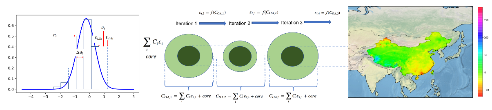
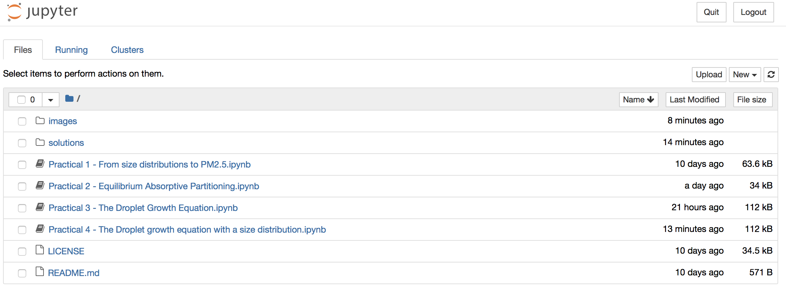

# Aerosol_CDT_modelling
A collection of practicals for the EPSRC Aerosol CDT in Aerosol and Droplets

This repository contains a series of [Jupyter](https://jupyter.org) notebooks designed to practice modelling across Aerosol Sciences as part of the EPSRC funded [CDT](https://www.aerosol-cdt.ac.uk). 

This is an envolving course, with plans for much more content to be added. Please check the project wiki page for more information on updates and planned releases should you wish to follow this repository outside of the CDT module learning environment. This project is licensed under the terms of the Creative Commons (CC) License v3.0, as provided with this repository. 

# Table of contents
1. [Course overview](#Course-overview)
2. [Dependencies and running examples](#Dependencies)
     * 2a. [The current course (2020)](#Course-note)
3. [Folder structure and running the examples](#Folder-Structure)
4. [Expectations and pace of learning](#Expectations)
5. [Code of Conduct](#Code-of-Conduct)

## Course overview

This course has been developed with the notion that learning any programming language is most effective when provided with domain relevant examples. However, it is also important to cover some basic/fundamental operations. In each notebook you will find a narrative that matches an associate lecture, though they should be able to provide learning material on their own. 

To obtain the course material, you will need to clone this repository into a local folder. Create a folder on your machine, and then run the following command from a command prompt:

git clone https://github.com/loftytopping/DEES_programming_course.git

## Dependencies and running examples 

The material provided has been built in the [Anaconda Python 3.7 environment](https://www.anaconda.com/download/#macos). [Assimulo](http://www.jmodelica.org/assimulo). Depending on your operating system you can install this by downloading the relevant installation script from the [Anaconda webpage](https://www.anaconda.com/distribution/). The current release should work in the vanilla installation of the Anaconda environment, which will provide you with all of the modules we will be using, namely:
 
#### Used modules:

Module        |  Note
------------- | -------------
[matplotlib](https://matplotlib.org/)    |  A plotting package
[numpy](https://www.scipy.org/scipylib/download.html)         |  A numerical package designed for efficient operations
[pandas](https://pandas.pydata.org/)        |  A module dedicated to data structures and data analysis tools.
[scipy](https://www.scipy.org)         |  (pronounced “Sigh Pie”) is a Python-based ecosystem of open-source software for mathematics, science, and engineering
[time](https://docs.scipy.org/doc/numpy/f2py/)  |  A module for checking duration, introducing time-dependent operations etc
[Seaborn](https://seaborn.pydata.org)  |  data visualization library based on matplotlib
 
To start any notebook, move to the folder in which you have cloned this repository and type the following command in a command prompt

> jupyter notebook

**Important note**: IF you are somehow prompted for a token/password from the Jupyter notebook server, you can use the following to run our jupyter notebooks.

> jupyter-notebook --notebook-dir .\ --NotebookApp.token='' --NotebookApp.password=''

Once you have succesfully started a Jupyter notebook server, you should find a web browser takes you to the default home page which will look like the following figure:

From here you will then be able to click on any of the jupyter notebooks, or folders, to access the material you are interested in.

## Repository structure and using Jupyter notebooks 

    .                           # Root folder of our repository
    ├── images                  # Contains images for all notebooks
    ├── solutions               # Contains the same notebooks as in our root folder but with solutions
    |------ images                # images used in solutions notebooks
    ├── Practical 1 - From size distributions to PM2.5.ipynb       # Individual notebook practicals
    ├── Practical 2. ....
    ├── LICENSE
    └── README.md
    
## Expectations and pace of learning

We cant teach everything Python or any programming language has to offer in this course, but we can given you a set of tools to begin your journey into the wonderful world of programming and data analysis in aerosol science. Please note that you should not feel pressured to complete every exercise in class. These practicals are designed for you to take outside of class and continue working on them. Proposed solutions to all exercises can be found in the 'solutions' folder. After reading the instructions and aims of any exercise, search the code snippets for a note that reads ------'INSERT CODE HERE'------ to identify where you need to write your code. These are often proposed solutions and you may have your own way of solving then. That is fine! Quite often in programming there are many ways to 'cut the cloth'. In this course we will not cover optimisation but try to stick to a 'Pythonic' way of solving things without sacrificing your learning path. 
    
## Code of Conduct

Please note that this project is released with a Contributor Code of Conduct. By participating in this project you agree to abide by its [terms](code-of-conduct.md). 

## Disclaimer
Content is distributed in the hope that it will be useful, but WITHOUT ANY WARRANTY; without even the implied warranty of MERCHANTABILITY or FITNESS FOR A PARTICULAR PURPOSE.  See the GNU General Public License for more details.                                                                            You should have received a copy of the GNU General Public License along with this repository.  If not, see <http://www.gnu.org/licenses/>.            
